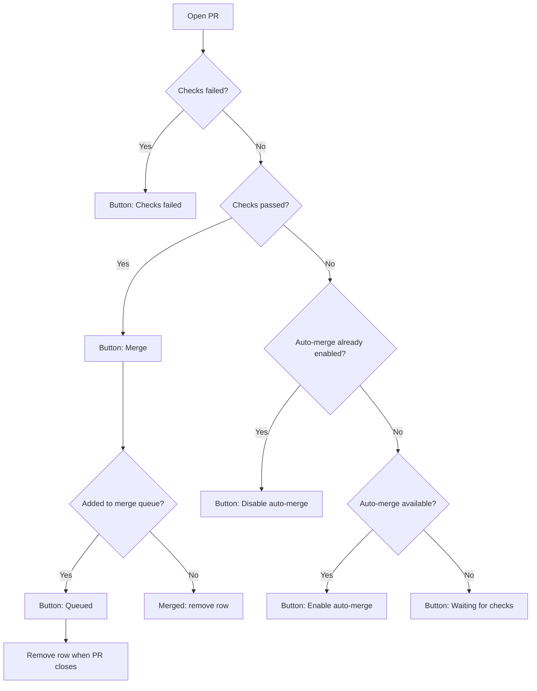

# Merge Button States

This is the proposed user-facing flow for the PR row merge button. The button should describe the next useful action without exposing whether the repo merges directly or uses a merge queue.

## Proposed Flow

## Button States

| PR state | Button | User meaning |
| --- | --- | --- |
| Checks pending and auto-merge available | `Enable auto-merge` | Merge this PR automatically once it becomes eligible. |
| Auto-merge enabled | `Disable auto-merge` | Auto-merge is scheduled; click to cancel it. |
| Checks pending and auto-merge unavailable | `Waiting for checks` | This PR is not ready, and auto-merge cannot be enabled here. |
| Checks passed | `Merge` | Complete the PR now. This may merge directly or enter the merge queue. |
| Already in merge queue | `Queued` | This PR is waiting in the merge queue. |
| Checks failed | `Checks failed` | No primary merge action until checks recover. |
| Merged | No row | The PR is done and leaves the open list. |

## Product Notes

`Merge` should hide the repo implementation detail. In a normal repo, it merges the PR. In a merge queue repo, it adds the PR to the queue.

`Enable auto-merge` should only appear when GitHub supports auto-merge for that PR. Not every PR has this option: the repo must allow auto-merge, the user must have permission, and GitHub must consider the PR eligible for auto-merge.

`Disable auto-merge` should look like an active button, not a disabled status pill. It represents a reversible scheduled state.
