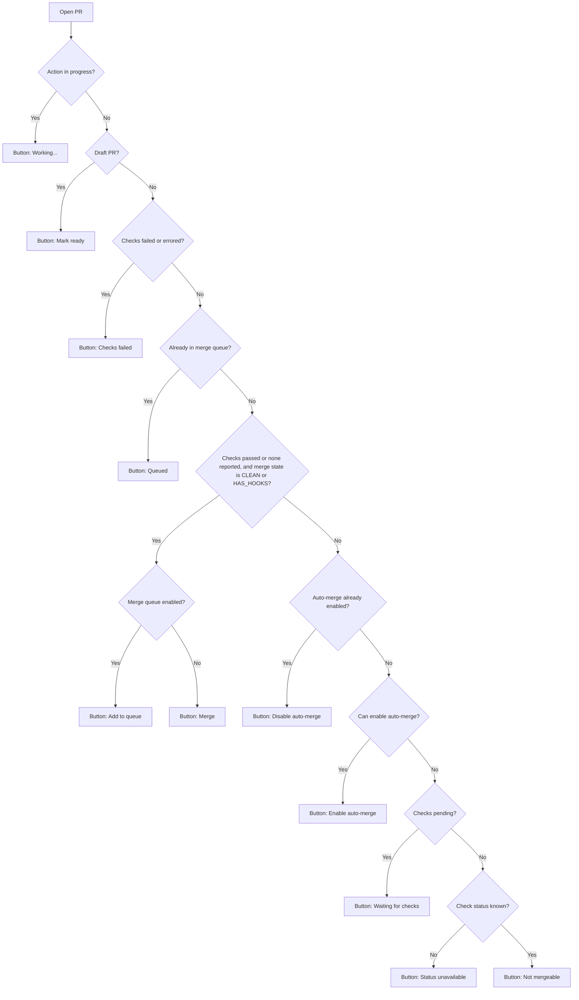

# Pull Request Action Button States

This flow describes the action button shown on each open PR row. Draft state and GitHub's merge state determine which action is available; check status alone does not determine whether a PR can merge.

## Flow

## Button States

| PR state | Button | User meaning |
| --- | --- | --- |
| Action is in progress | `Working...` | The requested GitHub action is running. |
| Draft PR | `Mark ready` | Mark this draft PR ready for review. |
| Checks failed or errored | `Checks failed` | No primary merge action until checks recover. |
| Already in merge queue | `Queued` | This PR is waiting in the merge queue. |
| Checks pass or none are reported, merge state is `CLEAN` or `HAS_HOOKS`, and no queue is enabled | `Merge` | Merge the PR now. |
| Checks pass or none are reported, merge state is `CLEAN` or `HAS_HOOKS`, and a queue is enabled | `Add to queue` | Add the PR to the merge queue. |
| Auto-merge enabled | `Disable auto-merge` | Cancel the scheduled auto-merge. |
| Auto-merge can be enabled | `Enable auto-merge` | Merge automatically once GitHub considers the PR eligible. |
| Checks are pending and no auto-merge action is available | `Waiting for checks` | Checks are still running, and auto-merge cannot be enabled here. |
| Check status is unknown and no auto-merge action is available | `Status unavailable` | GitHub did not provide a usable check status. |
| Otherwise not mergeable | `Not mergeable` | GitHub's merge state prevents a merge or queue action. |
| Merged | No row | The PR is done and leaves the open list. |

## Product Notes

`EXPECTED` with zero rollup contexts is displayed as `No checks reported`. It counts as passing for the check-status gate, but merge and queue actions still require GitHub to report a merge state of `CLEAN` or `HAS_HOOKS`.

`Add to queue` is shown when the base branch has a merge queue and the PR can merge immediately. Without a merge queue, that same eligible PR shows `Merge`.

Draft PRs show `Mark ready` regardless of check status. After the mutation succeeds, the app refreshes the open PR list to pick up GitHub's updated state.

`Enable auto-merge` appears only when GitHub allows the viewer to enable it. `Disable auto-merge` remains an active, reversible action.

## Implementation

`MergeButtonState.resolve(for:isWorking:)` in `GithubPanel/Models/MergeButtonState.swift` is the single source of truth for this flow. The row's button label and `PRMonitor.requestMerge(for:)` both switch on its result, so the action performed always matches the label shown.
